### 一、分析背景
随着人工智能、大数据等技术的发展和应用，越来越多的网络用户行为被自动化设备记录下来，通过对海量的用户行为数据进行深入挖掘和分析，能够全面掌握用户的实际需求并根据分析结果持续改进产品的设计，从而能够不断优化产品运营、指导产品营销，实现业务增长。

本数据集选取了UserBehavior淘宝联盟用户行为数据，其中包含了从2017年11月25日至2017年12月3日之间，有行为的约10000名随机用户的行为（包括点击、购买、加购和收藏），数据规模约100万。

### 二、分析目的
通过对用户行为数据进行统计、分析，从用户行为中理解用户需求，总结用户使用产品的规律，从而发现产品功能、营销策略以及运营策略存在的问题，实现更精准和精细的营销与运营，提高用户购买体验、助力商家获利同时实现平台业务增长。

### 三、理解数据
#### 1.数据源
数据来自淘宝联盟（原阿里妈妈）用户，本数据集（UserBehavior.csv）包含了2017年11月25日至2017年12月3日之间，有行为的约一百万随机用户的所有行为（行为包括点击、购买、加购、喜欢）。数据源：[User Behavior Data from TaoBao for Recommendation-数据集-阿里云天池](https://link.zhihu.com/?target=https%3A//tianchi.aliyun.com/dataset/dataDetail%3FdataId%3D649%26userId%3D1)

数据集的每一行表示一条用户行为，由用户ID、商品ID、商品类目ID、行为类型和时间戳组五个字段成，并以逗号分隔。

#### 2.字段含义

 

其中用户行为类型有四种：

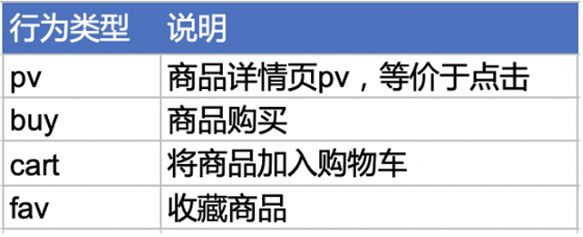

#### 3.数据集规模

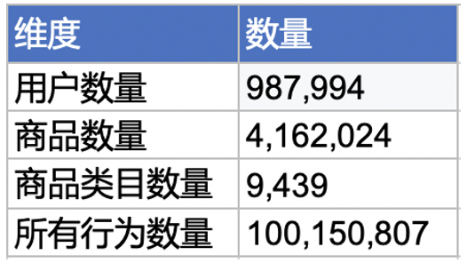

### 四、分析思路
使用**多维度拆解分析方法**将实际业务问题进行拆解，并利用**对比分析方法**、**假设检验分析方法**、**漏斗模型**和**RFM分析方法**对具体的业务指标和业务流程进行分析。

提出问题：

+ 热销产品/类目，优化产品结构

+ 了解用户活跃的日期以及每天活跃的时间段

+ 建立RFM模型分析用户行为，对用户按价值进行分类，针对不同价值的用户提出不同的运营建议*

+ 用户从浏览到最终购买整个过程的流失情况，从而有目的性的进行统计*

+ 产品基础指标：pv、uv等；流量质量指标：平均购买次数、用户留存率、复购率等

### 五、数据处理
（一）准备数据

使用Navicat导入功能，将数据导入，如图：

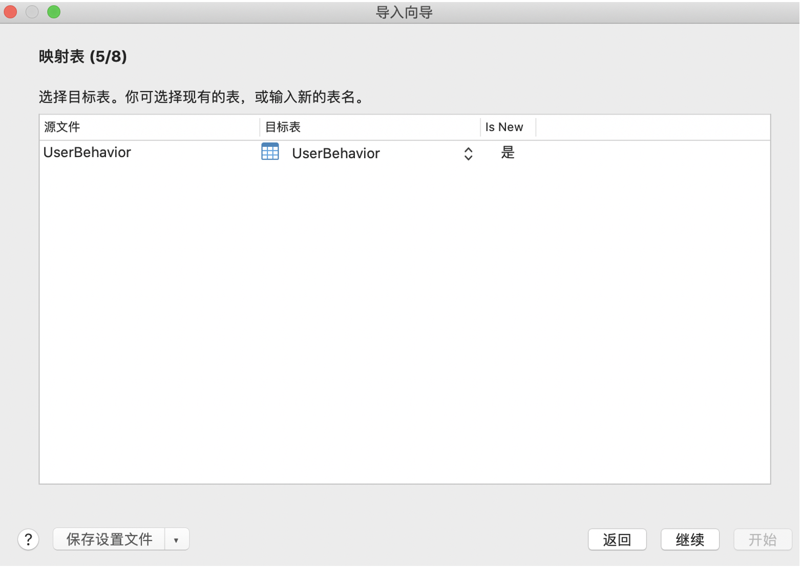

（二）数据清洗

1.列名重命名

原表数据导入时，由于没有表头，需要将列名重命名：

	alter table UserBehavior change `1` user_id varchar(255);
	alter table UserBehavior change `2268318` item_id varchar(255);
	alter table UserBehavior change `2520377` cat_id varchar(255);
	alter table UserBehavior change `pv` behavior_type varchar(255);
	alter table UserBehavior change `1511544070` time_stamp varchar(255);
结果如下:

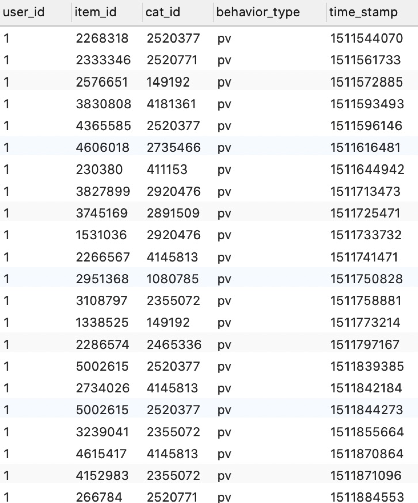

2.删除重复值

	select * from UserBehavior 
	group by user_id,item_id,behavior_type,time_stamp
	having count(*) > 1;
	
结果如下：

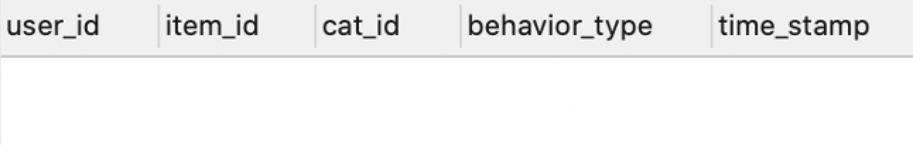

数据集中不含重复值。

3.缺失值处理

	select 
	count(user_id) as '用户数量',
	count(item_id) as '商品数量',
	count(cat_id) as '商品类目数量',
	count(behavior_type) as '用户行为数量',
	count(time_stamp) as '时间戳数量'
	from UserBehavior;

结果如下：

数据集中不存在缺失值。

4.一致化处理

从数据集导出的数据中日期是时间戳形式，需要将其表示成日期和时间和小时，便于后续分析。

	-- 新增日期列
	alter table UserBehavior add date varchar(255);
	update UserBehavior set `date`  = FROM_UNIXTIME(time_stamp,'%Y-%m-%d');

	-- 新增时间列
	alter table UserBehavior add time varchar(255);
	update UserBehavior set `time`  = FROM_UNIXTIME(time_stamp,'%H:%m:%s');

	-- 新增小时列
	alter table UserBehavior add `hour` varchar(255);
	update UserBehavior set `hour`  = SUBSTRING(FROM_UNIXTIME(time_stamp) from 	12 for 2);
	
结果如下：

5.异常值处理

数据集采集的用户行为数据时间在2017年11月25日至2017年12月3日之间，因此不在此区间的异常值需要剔除。

	-- 删除异常日期数据
	delete from UserBehavior
	where date > "2017-12-03" 
   	or date < "2017-11-25";
	-- 验证
	select max(`date`), min(`date`)
	from UserBehavior;
	
结果如图：

剔除异常值后，数据总量为999530条。

### 六、分析过程

**1.热销商品类目/商品**

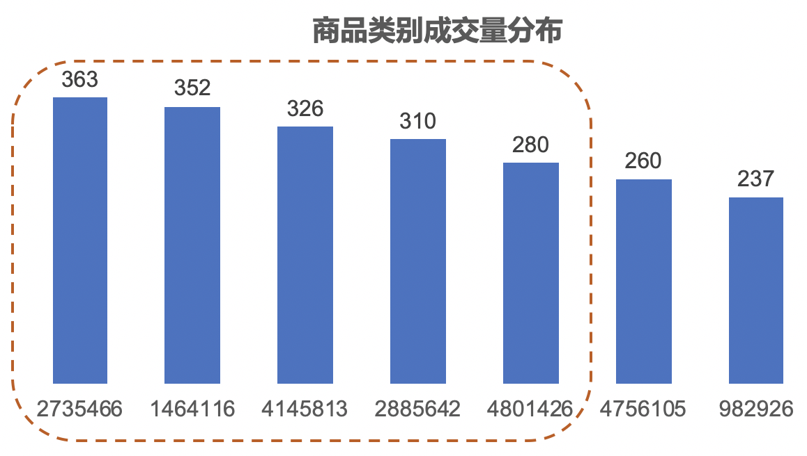

在所有的5793个类目的产品中，只有上述7类产品成交量超过200，其中top5类目分别是2735466、1464116、4145813、2885642和4801426，针对这5大类畅销类目产品，商家应应加大活动宣传力度，必要时可以进行秒杀抢购、预售等活动。

商家可以针对每个商品类目下的畅销商品着重营销，加大活动推广力度，注意库存管理。

**2.用户行为习惯分析**

	select 
		date as '日期',
		sum(case when behavior_type = 'pv' then 1 else 0 end) as '点击数',
		sum(case when behavior_type = 'buy'then 1 else 0 end) as '购买数',
		sum(case when behavior_type = 'cart'then 1 else 0 end) as '加购数',
		sum(case when behavior_type = 'fav'then 1 else 0 end) as '收藏数'
	from UserBehavior
	group by `date`;

总体来说用户日均活跃度大致平稳，但在12月2日和12月3日出现小幅增长，其中点击数、加购数、收藏数增加明显，但购买量增幅放缓，经分析，考虑到十二月份节日活动较多，部分商家选择在月初进行活动预热，用户偏向于提前收藏、加入购物车，符合预期习惯。

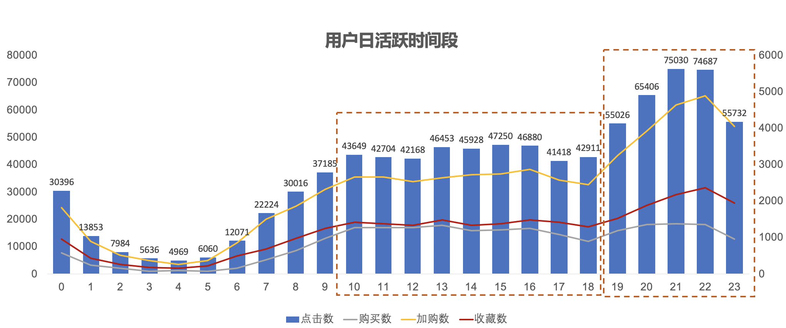

用户活跃度在凌晨到4点之间骤减，5点到9点攀升，10点到18点趋于平稳，19点到22点急剧攀升并在21点达到峰值，随后下降。符合用户作息时间规律，可以考虑在20-23点之间上架新品，或者借机举行促销活动以此来提高商品转化率。

**3.建立RFM模型分析用户行为**

RFM模型是衡量客户价值和客户创利能力的重要工具。RFM分析方法通过最近一次消费时间间隔（Recently）、消费频率（frequency）、消费金额（money）三个指标对用户进行分类。

**最近一次消费消时间间隔：**反映客户对产品的态度以及品牌价值的信任度，关乎用户的留存状况。用户最近一次消费时间距离今日时间越近，当前的活跃度将会越高，用户价值也越高。本数据集选取的时间跨度为2017年11月25日至2017年12月3日之间，因此选择用户最近一次消费距2017年12月3日的间隔。最近一次消费是最有力的预测指标。由于本数据集缺少消费金额相关数据，故仅使用消费时间间隔、消费频率两个指标进行分类。

**消费频率：**消费频率是顾客在限定的期间内所购买的次数，反映了用户的忠诚度。用户的购买行为越频繁，就会有更高的活跃度和交易价值。采用2017年11月25日至2017年12月3日之间用户的消费次数作为消费频率。

**消费金额：**指用户在特定时间段内消费的金额，反映客户的价值，客户价值越高，用户为企业的创利越高。

由于数据集中缺少金额相关数据，本次分析，仅使用R和F对客户价值进行评分。

1）计算R、F值：
	
	-- 计算RF值
	create view rfm as(
	select a.user_id,datediff('2017-12-03',a.date) as R,b.F from(
	select *,
	dense_rank() over (partition by user_id order by date desc) as 'dense_ranks'
	from buyer) as a inner join (
	select user_id, count(user_id) as F
	from buyer
	group by user_id) as b
	on a.user_id = b.user_id
	where dense_ranks = 1);

2）对R、F值进行打分

2017年11月25日至2017年12月3日之间，用户最近一次消费时间间隔最久为8天，消费频率最高为72次。下表定义打分标准：

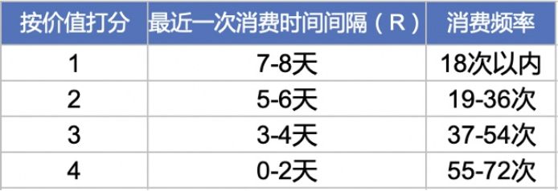

	-- 计算rf得分
	create view rfm_score as(
	select 
		user_id,
		R,
		F,
		case when R <= 2 then 4 
	     	when R between 3 and 4 then 3
          when R between 5 and 6 then 2
	     	when R between 7 and 8 then 1
	       else 0
	 	end as R_score,
	 	case when F <=18 then 1
	      when F between 19 and 36 then 2
	      when F between 37 and 54 then 3
	      when F between 55 and 72 then 4
	      else 0
	  	end as F_score
	from rfm);
	
结果如下：

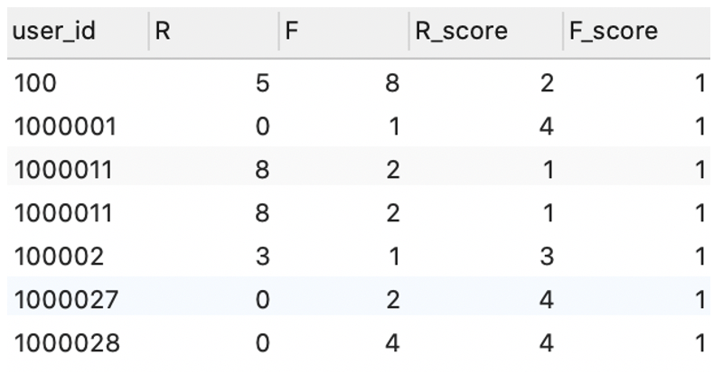

3）用户分类

用户R、F得分大于平值，标签记为'高'，否则记为'低'，用户分类标准如下：

	-- 计算R、F等级
	create view rfm_level as(
	select 
    	*,
    	case when R_score >= (select avg(R_score) from rfm_score) then '高' else '低' end as R_level,
    	case when F_score >= (select avg(F_score) from rfm_score) then '高' else '低' end as F_level
	from rfm_score);

	-- 统计用户数量
	select user_tag, count(*)
	from(
	select *,
		case when R_level = '高' and F_level = '高' then '重要价值客户'
     		  when R_level = '高' and F_level = '低' then '重要发展用户'
     	     when R_level = '低' and F_level = '高' then '重要保持客户'
     	     when R_level = '低' and F_level = '低' then '一般挽留用户'
     	     else null
	    end as 'user_tag'
	from rfm_level) as a
	group by a.user_tag;

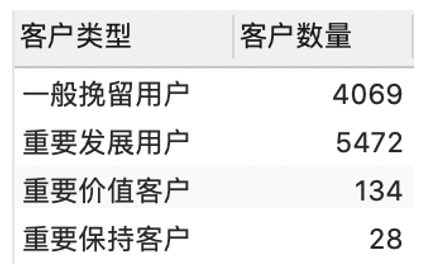

**经过统计发现，用户集中在一般挽留用户和重要发展用户上。**

+ 对于重要价值用户：用户较为优质，上一次消费距离近且消费频率高，需重点关注，应该给其提供VIP服务，提高用户满意度，注意用户留存。

+ 对于重要保持客户：最近一段时间没有产生购买，但以往购买频率很高，有可能用户正在损失，可以采用红包、优惠券、买赠等方式刺激用户消费。

+ 对于重要发展用户：最近一段时间有购买，但是够买频率不高，作为新增用户，具有巨大潜力，需注意引导，个性化推荐产品，增加用户粘性。

+ 对于一般挽留用户：他们最近没有购买，以往购买频率也不高，用户往往已经流失或正在流失，可以考虑电话或邮件回访客户了解其流失原因，同时需要对有类似特征的群体进行预警，以降低损失。

**4.漏斗模型分析用户流失**

**数据概览**

统计数据集中各行为数、人数以及人均行为次数：

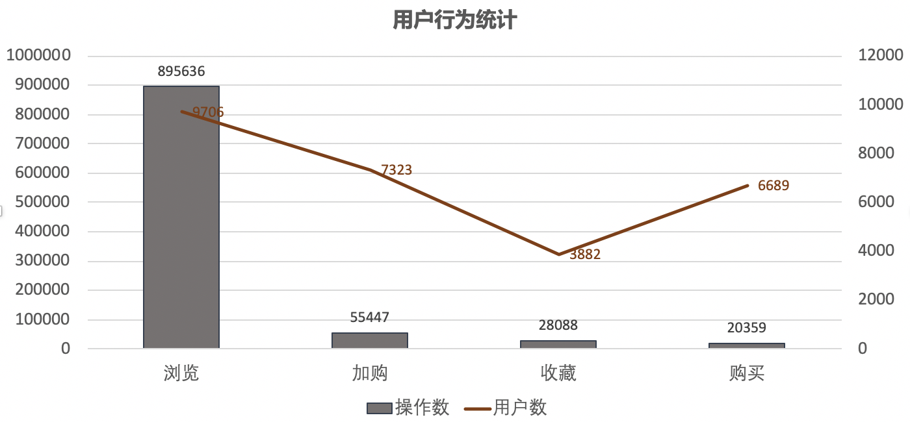

数据显示浏览行为占所有用户行为的90%，而加购和收藏行为仅占8%，购买行为占2%，由此可见用户在操作的环节过程中存在大量的流失情况。到底是什么原因造成用户的大量流失？针对这个问题提出两个假设，假设1：平台推荐效果不好，无法满足用户需求；假设2：不同的购买流程影响了转化率

**假设1：平台推荐商品类别/种类效果不好，无法满足用户需求**

1）平台推送的商品类别是否满足用户需求

**平台推送商品类别：**

	select cat_id,count(cat_id) as '点击次数'
	from UserBehavior
	where behavior_type = 'pv'
	group by cat_id
	order by 点击次数 desc
	limit 10
	

top5浏览类别分别是4756105、4145813、2355072、3607361以及982926

**用户购买品类别**

	select cat_id,count(cat_id) as '购买次数'
	from UserBehavior
	where behavior_type = 'buy'
	group by cat_id
	order by count(cat_id) desc
	limit 10
	

top5购买类别分别是2735466、1464116、4145813、2885642以及4801426

**平台推送与用户购买相吻合的商品类别：**

经过内联结查询发现top5点击和购买的商品类别中仅有4145813一类商品吻合；top10点击和购买有4756105、4145813、982926、4801426、1320293、3002561这六类商品吻合。

2）平台推送的商品种类是否满足用户需求

**平台推送商品种类：**

	select item_id, count(item_id) as '点击次数'
	from UserBehavior
	where behavior_type = 'pv'
	group by item_id
	order by 点击次数 desc limit 10
	

**用户购买品种类**

	select item_id, count(item_id) as '点击次数'
	from UserBehavior
	where behavior_type = 'buy'
	group by item_id
	order by 点击次数 desc limit 10

**平台推送与用户购买相吻合的商品种类：**

通过内联结查询大发现top10点击和购买的商品种类不存在吻合。可以看出平台缺少畅销产品,在17565个产品中，最畅销的产品仅购买了17次。

因此假设1成立。top5点击量和购买量产品种类的吻合度仅为20%，top10点击量和购买量中吻合度仅为60%，平台商品类别和用户喜欢的商品类别吻合度较低，可以考虑针对用户喜爱的商品类别拓宽产品种类、挖掘周边产品。同时进一步对商品种类进行分析发现，top10点击与购买的吻合度为0，表明平台推送商品针对性不强，不能满足用户的需求。可以考虑优化推荐算法，分析用户的历史行为，个性化推荐符合用户要求的产品。

**假设2：不同的购买流程影响了转化率**

根据上述数据统计发现，用户在操作的环节过程中存在大量的流失情况。用户具体在哪个环节流失较大，需要进一步分析。用户有四种行为，分别是：点击、收藏、加购和购买。用户在购买过程中主要存在以下三种行为路径：

**1.浏览-支付**

**2.浏览-加购-支付**

**3.浏览-收藏-支付**

由于缺少部分业务数据，用户在进行支付操作的上一个操作并未可知，因此不能准确的断定支付流程是从详情页直接发起支付、还是通过收藏通道或者购物车通道进行支付。因此本工作将数据集按照不同用户、不同商品维度进行分组，分析每个用户对每个商品的不同行为，因此做出以下规定：用户仅进行了浏览，未收藏、未加购便认定用户选择了路径1；用户仅进行了浏览、加购便认为用户选择了路径2；用户仅进行了浏览、收藏便认定用户选择了路径3。

	-- 创建视图
	create view behavior as(
	select 
		user_id, 
		item_id, 
		cat_id,
		sum(case when behavior_type = 'pv' then 1 else 0 end) as pv,
		sum(case when behavior_type = 'buy' then 1 else 0 end) as buy,
		sum(case when behavior_type = 'cart' then 1 else 0 end) as cart,
		sum(case when behavior_type = 'fav' then 1 else 0 end) as fav
	from UserBehavior
	group by user_id, item_id, cat_id
	)
	
结果如下：

**第一条路径：浏览-支付**

	-- 浏览数
	select count(user_id) as '浏览数'
	from behavior 
	where pv > 0; 
	

	-- 浏览后支付
	select count(user_id) as '浏览后支付'
	from behavior
	where pv >0 and buy >0 and cart = 0 and fav = 0;

浏览后直接购买的转化率为1.3%。

**第二条路径：浏览-加购-支付**

	-- 浏览后加购
	select count(user_id) as '浏览后加购'
	from behavior
	where pv > 0 and cart > 0 and fav = 0;

	-- 浏览加购后支付
	select count(user_id) as '浏览、加购后支付'
	from behavior
	where pv > 0 and buy > 0 and cart > 0 and fav = 0;
	

加购后购买的转化率为0.3%

**第三条路径：浏览-收藏-支付**

	-- 浏览后收藏
	select count(user_id) as '浏览后收藏'
	from behavior 
	where pv > 0 and fav > 0 and cart = 0;

	-- 浏览收藏后支付
	select count(user_id) as '浏览、收藏后支付'
	from behavior
	where pv > 0 and buy > 0 and cart = 0 and fav > 0;

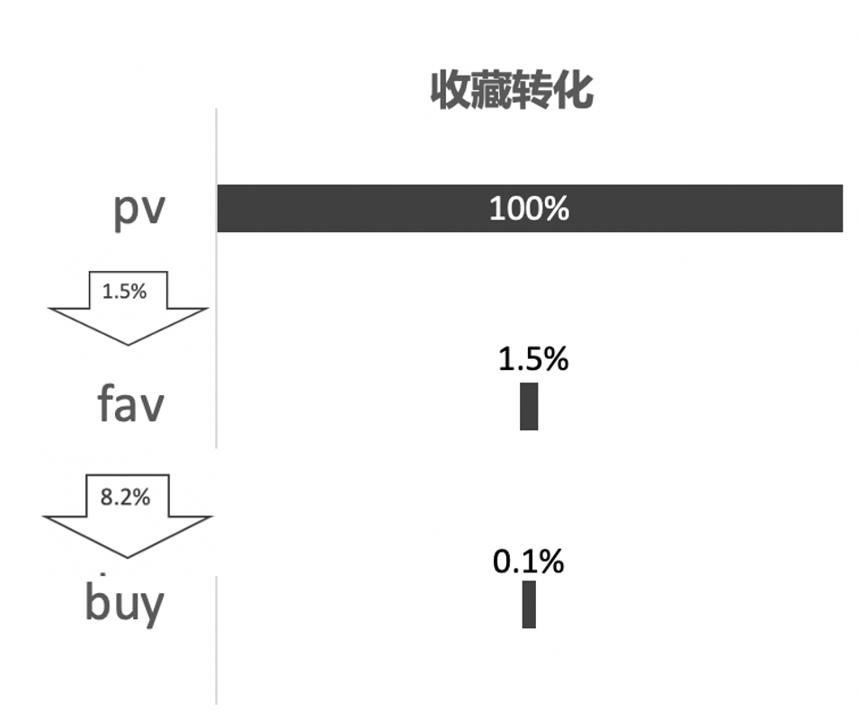

收藏后购买的转化率为0.1%

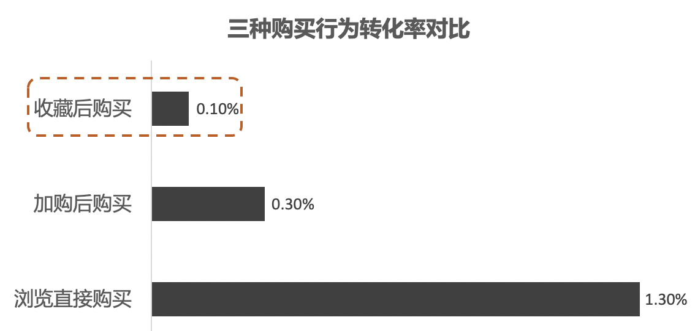

+ 三种行为中，浏览后直接购买的转化率高于其他两种购买行为的转化率，说明用户购物时更喜欢直接、简单的消费方式，而加入购物车以及收藏行为给用户增加了缓冲时间，一段时间后用户可能直接忘记购物车和收藏夹中商品的存在，或者直接失去购买兴趣选择删除购物车商品或者取消收藏。因此商家应该重视对商品详情页的设计，如提高阅读和视觉体验，独到的人文关怀等，从而提高转化率。

+ 假设2成立，加购后购买的转化率为0.3%，而收藏后购买的转化率仅为0.1%，相比购物车来说收藏功能的转化率很低，针对收藏功能可以对消费者进行问卷调查，看用户是否对收藏感兴趣，以及是否是用户习惯导致用户更喜欢加入购物车。

5.用户健康度分析

1）产品基础指标

**pv：页面浏览量**

**uv：独立访客数**

**pv/uv： 人均页面访问次数**

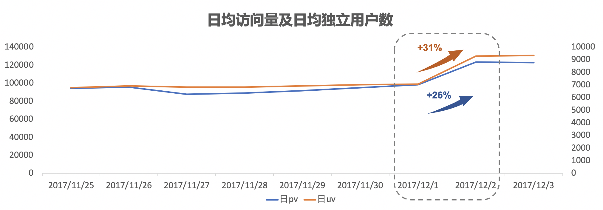

+ 上图看出12月2日访问量与日活跃用户数出现出现大幅增长，日pv较前日增长26%，日uv较前日增长了31%。

+ 人均页面访问次数稳定在13左右。

2）流量质量指标

**平均购买次数**

	select count(user_id)/count(distinct user_id) as '平均购买次数'
	from UserBehavior
	where behavior_type = 'buy'
	
用户平均购买次数为3次。

**用户复购率**

统计出不同购买次数的用户人数：

	select 购买次数, count(distinct user_id) as'人数'
	from(
	select user_id,count(user_id) as '购买次数'
	from UserBehavior
	where behavior_type = 'buy'
	group by user_id) as a
	group by 购买次数;
	
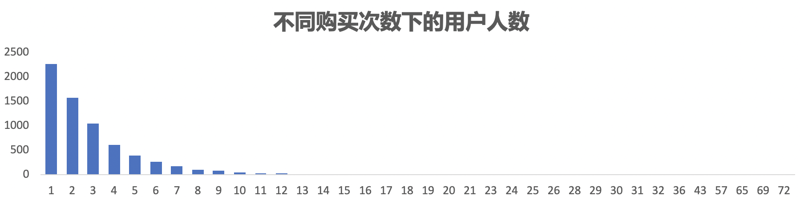

购买次数最多为71次，复购率为66.2%，超过一半以上的用户有过2次以及2次以上的购买经历，说明用户对平台的忠实度很高，粘性很大。可以考虑定期对购买次数大于7次的老客户进行重点维护，定期对其进行产品满意调查，提升产品的质量和客服人员的服务质量。

留存率：

	-- 用户最早登陆日期
	create view first_log as(select user_id, min(date) as first_log_time
	from UserBehavior
	group by user_id);
	
	-- 每日新增用户数
	select first_log_time, count(user_id) as '日新增用户数'
	from first_log
	group by first_log_time;
	
	-- 每位用户每天与第一次使用时间的间隔
	select a.user_id, a.date, b.first_log_time,DATEDIFF(a.date,b.first_log_time) 	as interval_days
	from UserBehavior as a inner join first_log as b
	on a.user_id = b.user_id
	group by a.user_id, a.date;
	
	-- 每天用户留存
	select 
		first_log_time,
		sum(case when interval_days = 0 then 1 else 0 end) as 'day_0',
       sum(case when interval_days = 1 then 1 else 0 end) as 'day_1',
		sum(case when interval_days = 2 then 1 else 0 end) as 'day_2',
		sum(case when interval_days = 3 then 1 else 0 end) as 'day_3',
		sum(case when interval_days = 4 then 1 else 0 end) as 'day_4',
		sum(case when interval_days = 5 then 1 else 0 end) as 'day_5',
		sum(case when interval_days = 6 then 1 else 0 end) as 'day_6',
		sum(case when interval_days = 7 then 1 else 0 end) as 'day_7',
		sum(case when interval_days = 8 then 1 else 0 end) as 'day_8'
	from(select 
		a.user_id, 
		a.date,
		b.first_log_time,
		DATEDIFF(a.date,b.first_log_time) as interval_days
	from UserBehavior as a inner join first_log as b
	on a.user_id = b.user_id
	group by a.user_id, a.date) as a
	group by first_log_time
	order by first_log_time;
	
	-- 用户留存率
	select 
		first_log_time,
		concat(round(100*day_0/day_0,2), '%') as 'day_0',
		concat(round(100*day_1/day_0,2), '%') as 'day_1',
		concat(round(100*day_2/day_0,2), '%') as 'day_2',
		concat(round(100*day_3/day_0,2), '%') as 'day_3',
		concat(round(100*day_4/day_0,2), '%') as 'day_4',
		concat(round(100*day_5/day_0,2), '%') as 'day_5',
		concat(round(100*day_6/day_0,2), '%') as 'day_6',
		concat(round(100*day_7/day_0,2), '%') as 'day_7',
		concat(round(100*day_8/day_0,2), '%') as 'day_8'
	from (select 
			first_log_time,
			sum(case when interval_days = 0 then 1 else 0 end) as 'day_0',
		    sum(case when interval_days = 1 then 1 else 0 end) as 'day_1',
			sum(case when interval_days = 2 then 1 else 0 end) as 'day_2',
			sum(case when interval_days = 3 then 1 else 0 end) as 'day_3',
			sum(case when interval_days = 4 then 1 else 0 end) as 'day_4',
			sum(case when interval_days = 5 then 1 else 0 end) as 'day_5',
			sum(case when interval_days = 6 then 1 else 0 end) as 'day_6',
			sum(case when interval_days = 7 then 1 else 0 end) as 'day_7',
			sum(case when interval_days = 8 then 1 else 0 end) as 'day_8'
	from(select 
			a.user_id, 
			a.date,
			b.first_log_time,
			DATEDIFF(a.date,b.first_log_time) as interval_days

	from UserBehavior as a inner join first_log as b
	on a.user_id = b.user_id
	group by a.user_id, a.date) as a
	group by first_log_time) as b;

每日用户留存数：

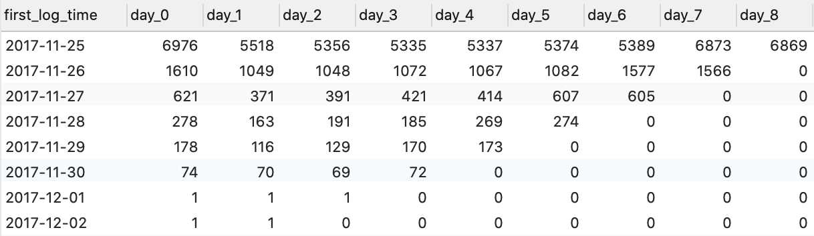

每日用户留存率：

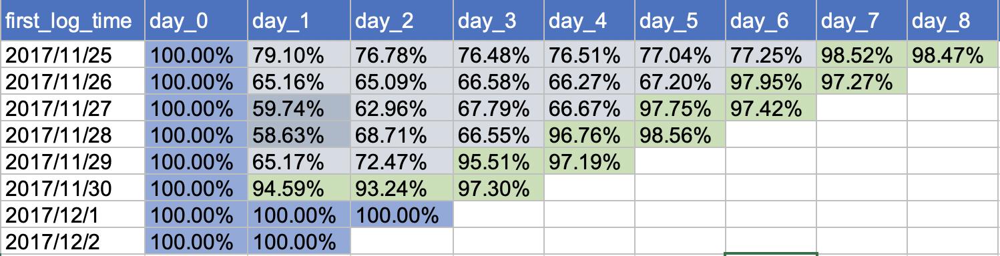

经分析：

用户留存率在60%到90%之间，其中12月2日和12月3日留存率都保持在98%左右，而12月2日和12月3日几乎没有新增，说明12月2日-3日并未才去拉新活动，可能是采取了促活活动，老用户活跃度有明显波动；留存率经过一段时间往往会趋于稳定，应将长期留存用户筛选出来作为忠实用户。由于本次数据集时间跨度为8天故无法对长期留存做相关预测。

六.结论与建议

1.结论

1）top5类畅销产品目分别为2735466、1464116、4145813、2885642和4801426，针对这5大类畅销类目产品，商家应应加大活动宣传力度，必要时可以进行秒杀抢购、预售等活动。

2）用户日均活跃度大致平稳，但在12月2日起出现大幅增长，其中点击数、加购数、收藏数增加明显，但购买量增幅放缓，考虑到十二月份节日活动较多，部分商家选择在月初进行活动预热，用户偏向于提前收藏、加入购物车，符合预期习惯。

3）用户活跃度在白天活跃时间段在10点到18点，黄金时间段在19点到23点之间，于21点达到一天活跃量峰值，这个时间段用户成交量最高。

4）用户人均每天访问页面13次左右，然而每位用户在8天中总计浏览30次左右才会产生一次购买行为，购买转化率很低，推测用户无法很快搜索到心仪的商品。导致跳出率很高。

5）复购率为66.2%，人均购买次数位3次，超过一半以上的用户有过2次以及2次以上的购买经历，说明用户对平台的忠实度很高，粘性很大。可以考虑定期对购买次数大于7次的老客户进行重点维护，定期对其进行产品满意调查，提升产品的质量和客服人员的服务质量。

6）用户浏览后直接下单的转化率高于购物车转化和收藏夹转化，表明用户更喜欢简单直接的购物方式。加购后股买转化率为0.3%，而收藏后购买的转化率仅为0.1%，加购的转化率为收藏夹转化率的3倍，针对收藏功能可以对消费者进行问卷调查，看用户是否对收藏感兴趣，以及是否是用户习惯导致用户更喜欢加入购物车。

2.建议

1）建议商家可以考虑在黄金时间段内发布新品，增加新品发布数量同时优化商品详情页，优化产品关键词（冷热门词使用策略）以提高产品曝光率。

2）考虑到三种购买途径中，用户更偏爱浏览后直接购物，建议商家应该重视对商品详情页的设计，如提高阅读和视觉体验，独到的人文关怀等，从而提高转化率。

3）建议商家对用户的行为轨迹进行分析，如根据用户的收藏加购以及搜索记录，确定用户的品味，同时根据浏览记录以及浏览时长细化用户需求，绘制符合用户的用户画像，分析用户的潜在需求，个性化推荐商品，以降低跳出率，增强用户粘性。

4）根据RFM对用户进行分类，对不同价值的用户实现精准运营，商家可以利用积分、优惠折扣、捆绑销售等措施挽留客户。针对用户id为107932等重复购买次数很多的用户需要建立详细的VVIP用户资料数据库，以对这类用户进行购买记录跟踪。

5）加入购物车到购买的转化率仅为10.3%，建议商家在用户假如商品至购物车后能诱导用户下单，如倒计时购物车增加用户消费的紧迫感。

